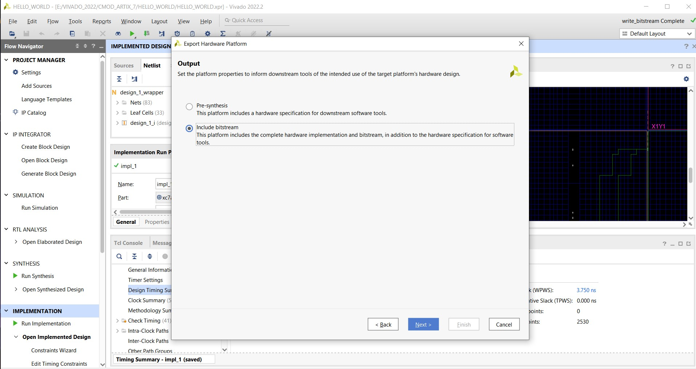
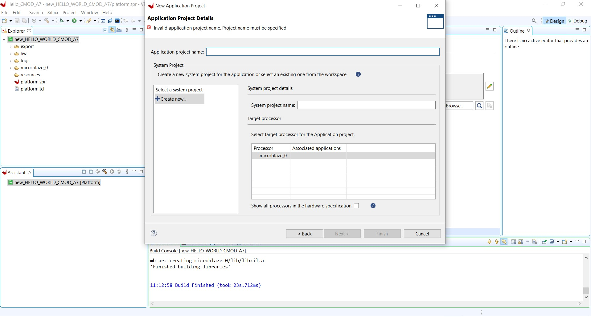

# MICROBLAZE_UART_DEMO_ON_CMOD_ARTIX-A7
This Project includes step-by-step guide for running a uart demo on the Microblaze soft core processor from AMD(Xilinx) on CMOD ARTIX-A7 FPGA .
before getting started , make sure you are having the following the below requirements-:
1. Xilinx VIVADO (could be any version -preferably later than 2019.2)
2. Xilinx VITIS  (remember , this has to be same as the vivado verison)..
   (instead of downloading Xilinx VIVADO , just install Xilinx VITIS tool , in which there you can select Vivado to be pre-installed )...
3. CMOD-ARTIX-A7 FPGA ( you can have any other from ARTIX family , or maybe spartan-7 , but then you have to select the same)
4. USB-cable

  if you are done all of the those , then let's go ahead .... 

1. Launch VIVADO
   give a suitable name to project ..
   

2. In next step , make sure you have board files installed , you just have to copy the
    files from repository , and paste in --: E:\VITIS_2020.2\Vivado\2022.2\data\boards\board_files

   in some case there would not be board_files folder , so you may create the same for that.
   Now select your FPGA board , in my case -- it's CMOD-ARTIX_A735T
   

3. Click Finish

   
   . 

4.click on -- "" create bock design in IP integrator section""
  give a name to this one as well.
  
  

5. Now , if you do not see the board file section , then click on window , then click-on-boards
   you'll then be able to see the all board tab .

   
   

6. drag the clock wizard from board section --to block interface

  

7. click on " + " sign in board interface , then write microblaze , select the microblaze by
   double-click .

   

 8. Now  , you'd be able to see the microblaze soft core IP in block interface ,
     "run block automation"

     

9.   set the following parameters as default.

   

 10. Now drag USB UART and cell RAM .

   

11.  "Run connection automation"

  

12. here's the final diagram created in block interface .

     

   # IMPLEMENTED DESIGN
    
   

 13. Now save the block diagram    
     file -> save_block_design

     

 14. Now Export Hardware--including bitstream
          
      

      

15. Remember to save this XSA FILE --in location--you'd be able to remember later

      

 # Now Let's move to VITIS

  open the VITIS software ...

  1. start the workspace , give a name and location for that..

      

  2. Create a platform project

     
     
  3. give a name to platform project

       

  4. Now ,if you remember the location and name of the XSA file then it's the time to use that
     in  this step..

      

  5.  Select OS as "Standalone" and Processor "Microblaze"

      
      
  6.  Here new window will pop-up

       

  7.   Now-right-click on the platform project (indicated in green color))
       click on build project
       

 8. Now the build is finished , then click on file->application project
 Select your platform project which you're currently working on (you already may have
      created by now from previous steps)

      
    
     
 9. Click next 

   

11. Now give a name to your application project

   
   
12.   choose hello world template
  
  

   

#   Now make sure you connect your respective fpga board with laptop.
 
 13.  click on xilinx tab -- then program device
  
     
   
    
14. Before proceeding to next step , make sure your uart termimal is open (I am using
    Tera-Term---- and had used --9600 bps while in creating block design) ..
   
15. By now , your device is programmed ....
    now , right-click on your application project (on left section --including written as standalone-microblaze in my case Just down to
    Cmod_A7_hello_system)

       
    
 15.  run as --> 1 Launch Hardware . 

        
      
  16 . wait unless it's loaded the bitstream into the fpga. Here's what you get on UART terminal according to what was written in hello world program .
      
   
 
           
    
 
    

   
   

